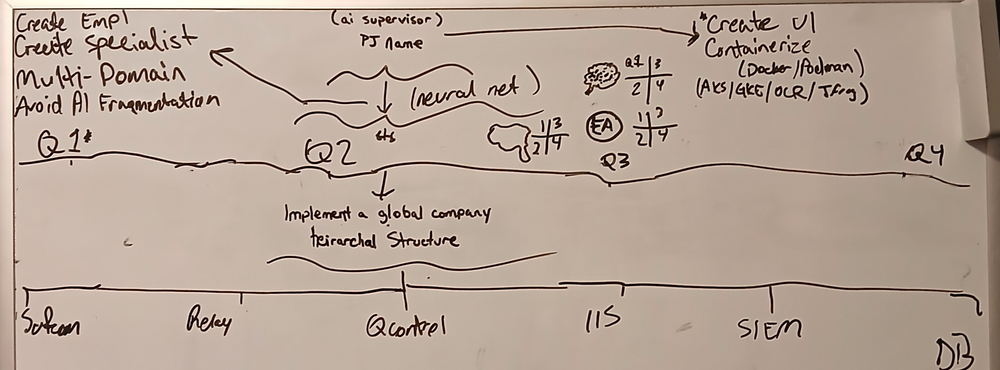
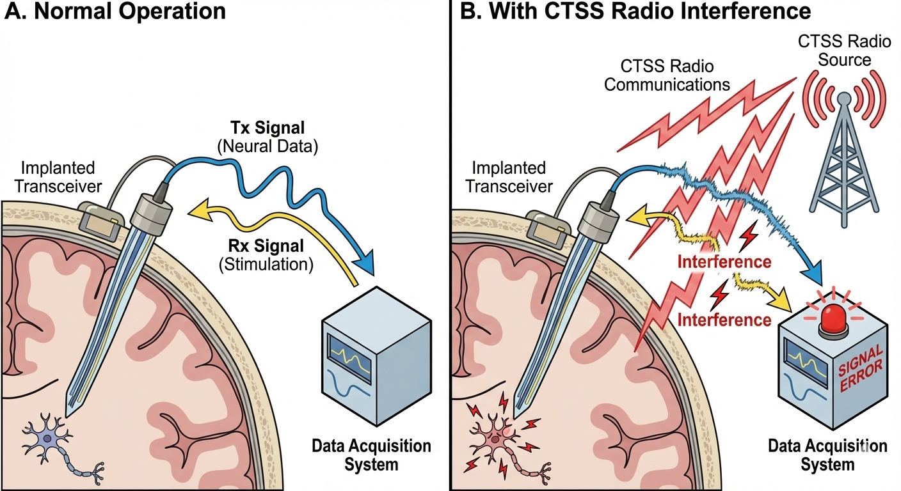

 - DNN light stimulation.
 - *How can I see what they see?*
 ---
 **This step is very important due to being able to open and close channels**
 
 **Must do better with image, re-representation of spectrum and bubble in a real-world setting horrible**
 - [HyperSpectral](https://arxiv.org/abs/2508.18219)
 - [CoOp Behavior](https://www.science.org/doi/10.1126/science.adw8151)
 - Create open and close COM channels for collaboration
 - Main focus is integrating into QNET

---
##CLEANUP
- [Emerging fiber-based neural interfaces with conductive composites](https://pubs.rsc.org/en/content/articlelanding/2025/mh/d4mh01854k)
- [Advances and perspectives in fiber-based electronic devices for next-generation soft systems](https://www.nature.com/articles/s41528-025-00465-w#Sec10)
- [Advanced Materials](https://advanced.onlinelibrary.wiley.com/journal/15214095)
- [Capacitive Soft Strain Sensors via Multicore–Shell Fiber Printing](https://advanced.onlinelibrary.wiley.com/doi/10.1002/adma.201500072)
- [Optical Noninvasive Brain–Computer Interface Development: Challenges and Opportunities](https://secwww.jhuapl.edu/techdigest/content/techdigest/pdf/V35-N04/35-04-Blodgett.pdf)
- [In Vivo Evaluation of Thermally Drawn BiodegradableOptical Fibers as Brain Implants](https://onlinelibrary.wiley.com/doi/epdf/10.1002/jbm.b.35549)

# Comprehensive platforms
---
- [Neurodesk](https://neurodesk.org/): A platform that uses software containers for accessible, flexible, and reproducible analysis. It includes a browser-accessible virtual desktop and command-line interface.
- [BrainForge](https://brainforge.rs.gsu.edu/): A cloud-enabled, web-based platform for archiving, processing, and sharing neuroimaging data. It utilizes popular software like Nipype and FreeSurfer.
- [Neuroconductor](https://neuroconductor.org/): An open-source platform for neuroimaging analysis in the R environment. It functions similarly to Bioconductor, providing a central repository for R packages.

---

# Specialized software
- [FreeSurfer](https://surfer.nmr.mgh.harvard.edu/): A suite of tools for analyzing structural MRI data, such as quantifying gray and white matter volume.
- [SPM (Statistical Parametric Mapping)](https://www.fil.ion.ucl.ac.uk/spm/): A MATLAB-based system for analyzing functional neuroimaging data to determine differences in brain activity.
- [Amira](https://www.thermofisher.com/us/en/home/electron-microscopy/products/software-em-3d-vis/amira-software.html): Offers 3D visualization and analysis for neuroscience research, with a specific focus on brain perfusion imaging data.
- [MIMneuro](https://www.mimsoftware.com/nuclear-medicine/mim-neuro): A software package for reviewing neuroimaging exams and gathering results, often used for PET scans. 

---

# Other resources
- [NITRC (Neuroimaging Informatics Tools and Resources Clearinghouse)](https://www.nitrc.org/): A resource for finding a wide range of neuroimaging software applications and other tools.
- [BrainStat](https://brainstat.readthedocs.io/en/master/): A toolbox designed for statistical analysis of neuroimaging data that can be used with both Python and MATLAB.

- [Bostonpiezooptics](https://www.bostonpiezooptics.com/optical-components): A resource for Optical Components
