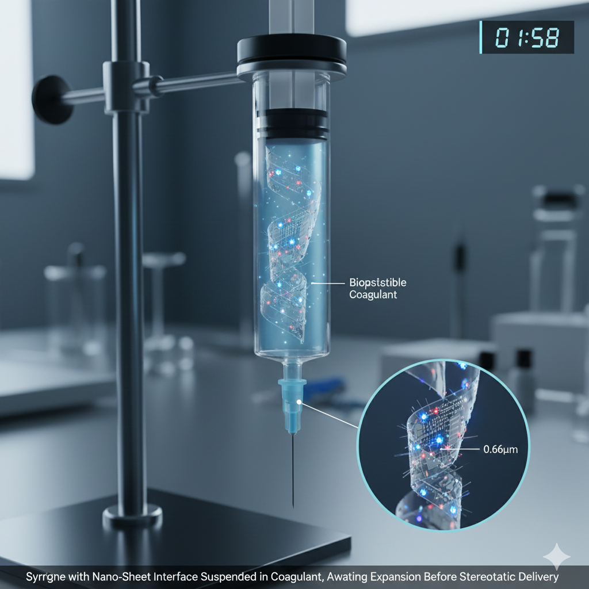
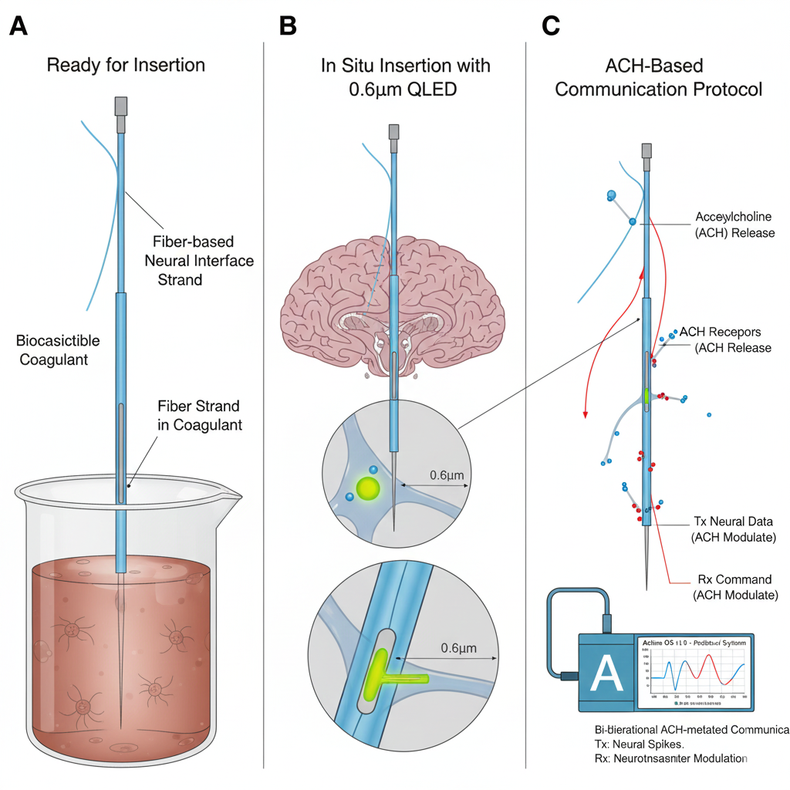

 - DNN light stimulation.
 - *How can I see what they see?*
 - Create open and close channels for collaboration
 **This step is very important due to being able to open and close channels
 - Main focus is integrating into QNET
