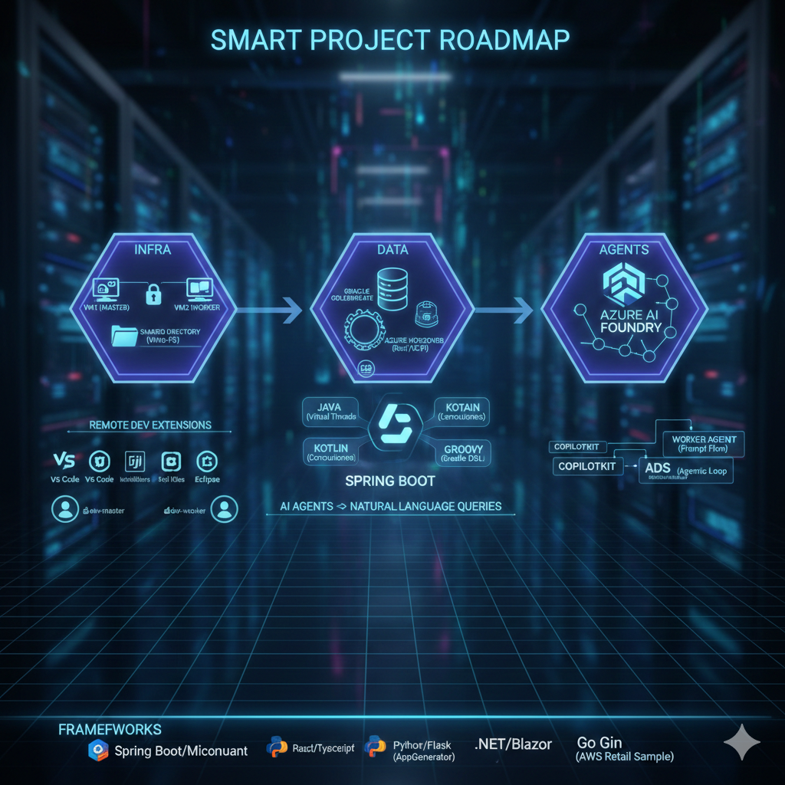

1. SMART Project Roadmap
To keep this from becoming overwhelming, we can break your vision into specific, measurable milestones.

Phase	Specific Goal	Measurable Result
Infra	Set up 2 VMs with a shared directory and IDE synchronization.	Successful "Hello World" sync between VM1 and VM2.
Data	Integrate HorizonDB with GoldenGate for SQL Server replication.	Verified real-time data flow from SQL Server to HorizonDB.
Logic	Build a SpringBoot backend using Java/Kotlin.	REST API endpoints active and connected to HorizonDB.
Agents	Deploy a Multi-Agent system using Azure AI Foundry & ADK.	Master agent successfully routes tasks to worker agents.

2. VM & Environment Setup
To achieve a "Shared Directory" and "Separate by Account" workflow, consider the following architecture:

Shared Directory: Use VMware Shared Folders or Virtio-FS (for Linux/KVM). This allows your host machine to act as the "Source of Truth" while both VMs mount the same directory.

IDE Strategy: Since you mentioned VS Code Insiders and IntelliJ, use the Remote Development extensions.

Tip: Keep your .git folder in the shared directory so that branch state is consistent across both VMs.

Accounts: Create dev-master and dev-worker accounts on the VMs to simulate a multi-user environment or permission-based testing.

3. Modern Database Stack (2025)
Azure HorizonDB

This is Microsoft’s newest cloud-native PostgreSQL-compatible database. It is unique because it uses a Rust-based storage engine and supports the Model Context Protocol (MCP).

Why use it? It allows your AI agents to query the database using natural language instead of just SQL.

Integration: Use Oracle GoldenGate to capture changes from your legacy SQL Server and stream them into HorizonDB for AI-driven analytics.

DB Browser vs. HorizonDB

Use DB Browser for local, lightweight SQLite testing.

Use the PostgreSQL extension in VS Code to manage HorizonDB, as it now includes "Metrics Intelligence" to help Copilot optimize your queries.

4. Frameworks & Multi-Agent Orchestration
SpringBoot: Java vs. Kotlin vs. Groovy

Java (25): Best for stability and leveraging "Virtual Threads" (Project Loom) for high-concurrency agent tasks.

Kotlin: The "Modern Java." Use this if you want concise code and built-in Coroutines, which are excellent for managing asynchronous agent handoffs.

Groovy: Best kept for Gradle build scripts or internal DSLs.

Agent Orchestration

Azure AI Foundry: This is your "Command Center." Use Prompt Flow to visualize the handoff between your Master Agent and specialized workers.

CopilotKit & ADK: Use the ADK (Agent Development Kit) to bridge your backend logic (Spring Boot) with your frontend (React).

AWS Strands: If you are working in the AWS ecosystem, Strands provides an "Agentic Loop" pattern (ReAct) that allows agents to reason and act autonomously within your VPC.

Next Steps

Would you like me to generate a docker-compose file to help simulate this multi-VM shared environment locally, or should we start by comparing a Java vs. Kotlin implementation for your first SpringBoot service?

[Deep Dive](https://www.youtube.com/watch?v=BJxrSKAvCis) into Azure HorizonDB This video provides a technical deep dive into the architecture of HorizonDB, specifically explaining how its Rust-based storage and AI integration work for mission-critical workloads.
<<<<<<< HEAD

To simulate a multi-VM environment (Remember Kubernetes .yml file config for creating a master and worker) with a shared directory and separate database services locally, we can use Docker Compose. This setup mimics your "Master/Worker" architecture by using two distinct containers that share a persistent volume, alongside your database stack.

Local Simulation Architecture

In this setup:

App-Master: Simulates your first VM (Master).

App-Worker: Simulates your second VM.

Shared-Data: A Docker volume that acts as the "Shared Directory" (Virtio-FS equivalent).

DB-Layer: Containers for SQL Server and PostgreSQL (simulating HorizonDB).

The docker-compose.yml File

YAML
services:
  # Database: SQL Server (Legacy/Source)
  sql-server:
    image: mcr.microsoft.com/mssql/server:2022-latest
    environment:
      - ACCEPT_EULA=Y
      - MSSQL_SA_PASSWORD=YourStrongPassword123!
    ports:
      - "1433:1433"

  # Database: PostgreSQL (Simulating HorizonDB/Target)
  horizondb-sim:
    image: postgres:16-alpine
    environment:
      - POSTGRES_PASSWORD=postgres
    ports:
      - "5432:5432"

  # VM 1: Master Environment
  app-master:
    image: eclipse-temurin:21-jdk # SpringBoot 3.x ready
    container_name: vm-master
    volumes:
      - shared-workspace:/mnt/shared
    environment:
      - USER_ACCOUNT=master
    command: /bin/sh -c "while true; do sleep 30; done" # Keeps it running

  # VM 2: Worker Environment
  app-worker:
    image: eclipse-temurin:21-jdk
    container_name: vm-worker
    volumes:
      - shared-workspace:/mnt/shared
    environment:
      - USER_ACCOUNT=worker
    command: /bin/sh -c "while true; do sleep 30; done"

volumes:
  shared-workspace:
    driver: local
How to use this for your SMART goals:

Test the Shared Directory:

Exec into the Master: docker exec -it vm-master /bin/sh

Create a file: echo "Hello from Master" > /mnt/shared/test.txt

Exec into the Worker: docker exec -it vm-worker cat /mnt/shared/test.txt

Result: You have confirmed the "Shared Directory" logic.

Separate by Account: The USER_ACCOUNT environment variable allows your Spring Boot application to detect which "VM" it is running on and adjust its logic (e.g., Master node vs. Worker node behaviors).

Database Connectivity: Your Spring Boot app (starting at start.spring.io) can now point its application.properties to jdbc:postgresql://horizondb-sim:5432/postgres.

Next Step

Since you mentioned starting with SpringBoot, would you like me to provide a basic Java controller that detects which "VM" it's on and logs the connection to the shared directory?
=======

>>>>>>> 2a37d6751c16567169acb3db617fb2e83de3aa4e